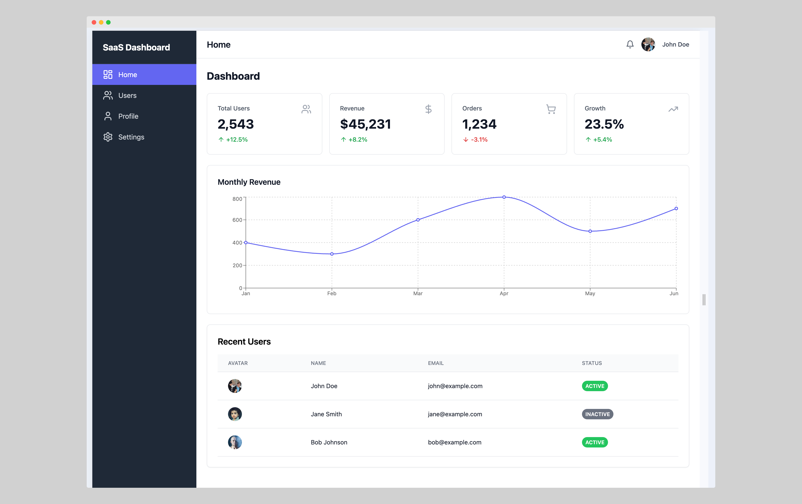
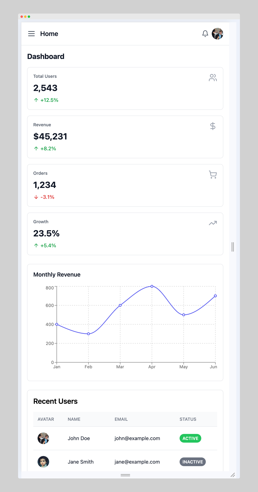
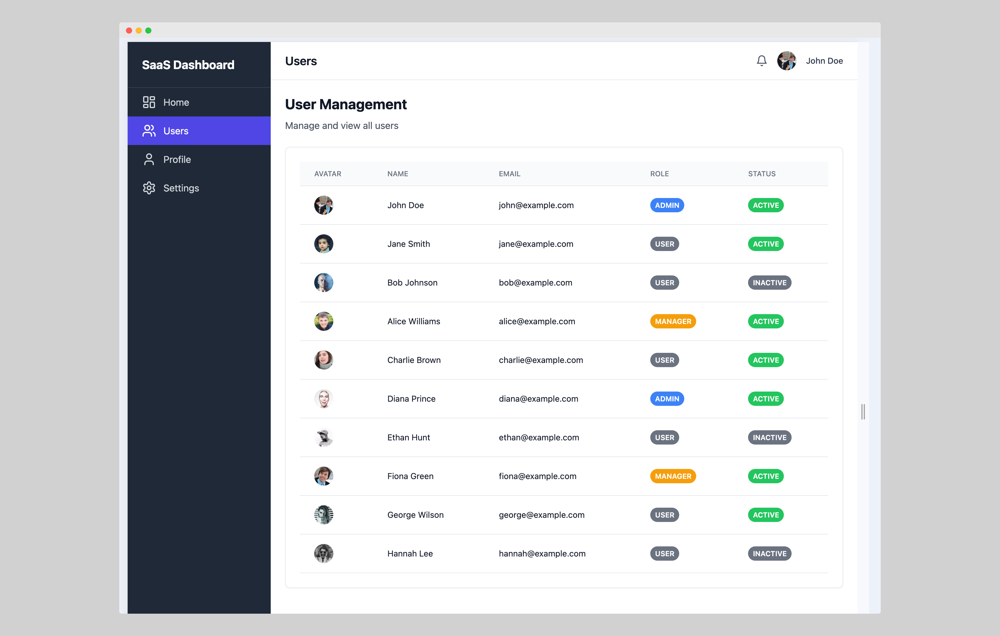
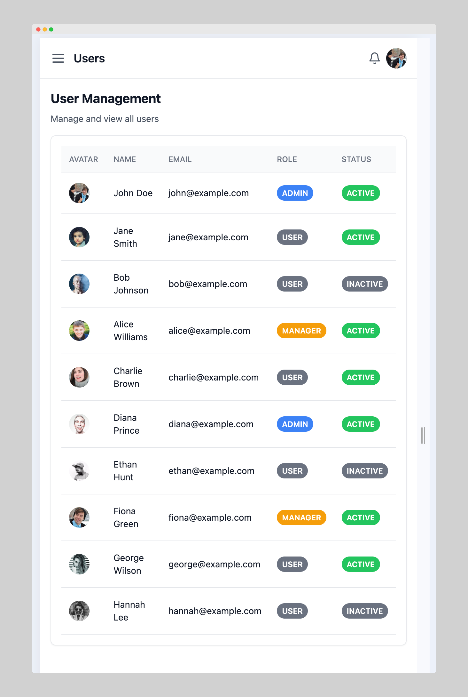
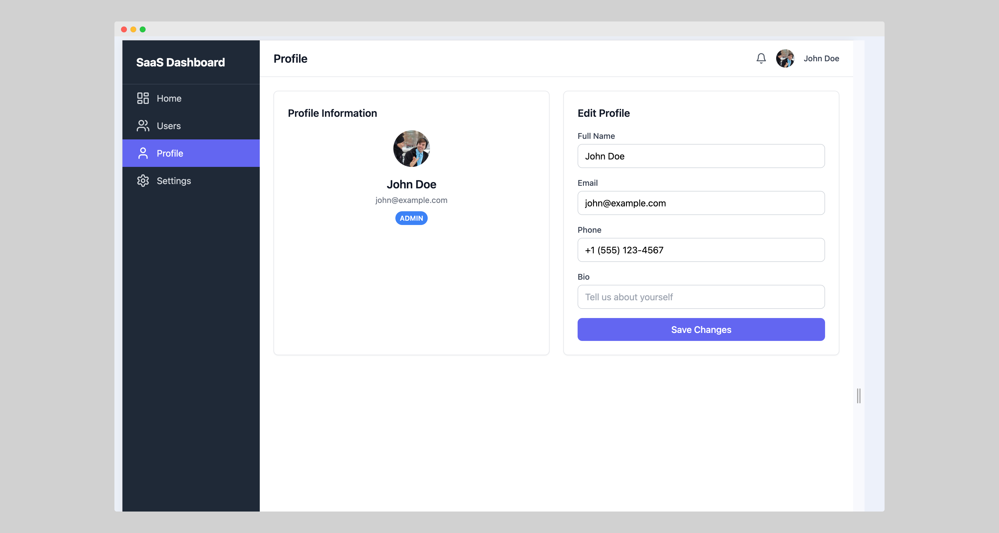
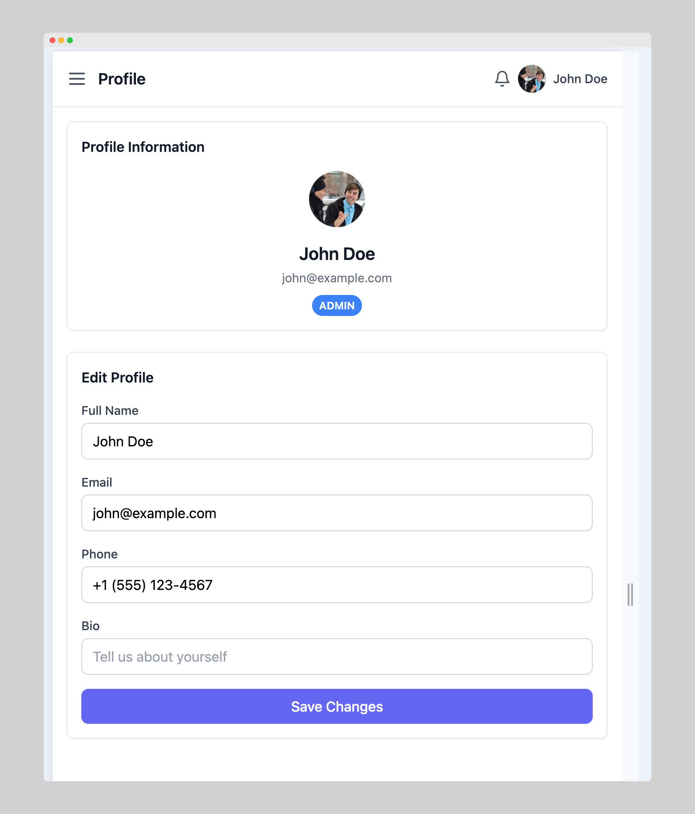
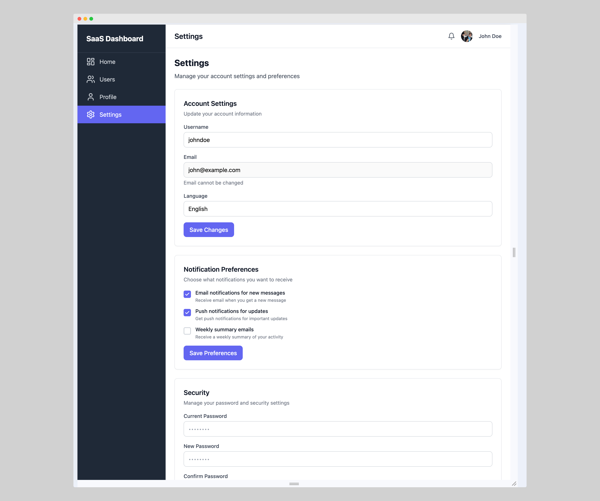
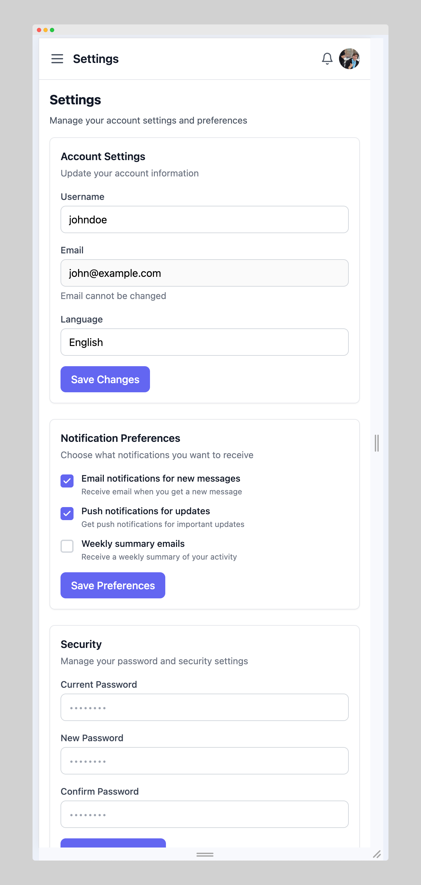
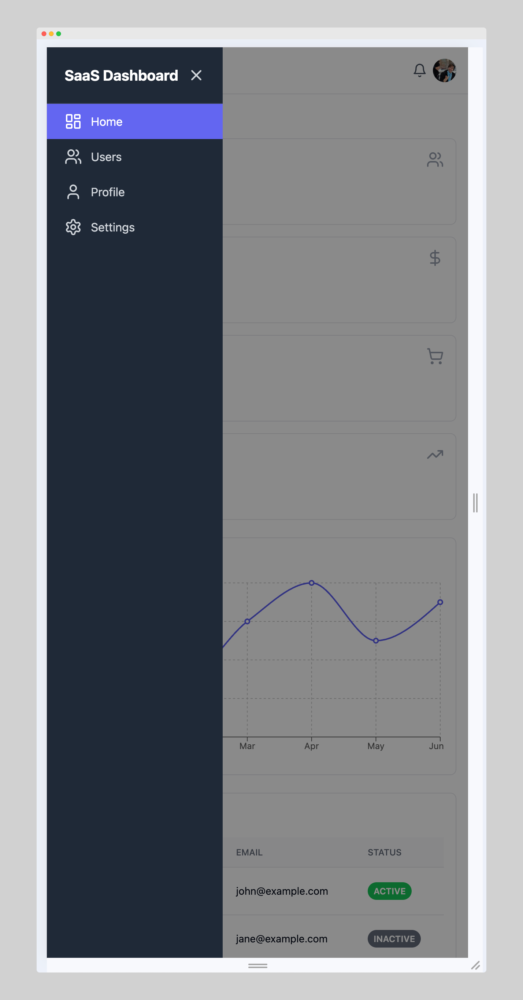
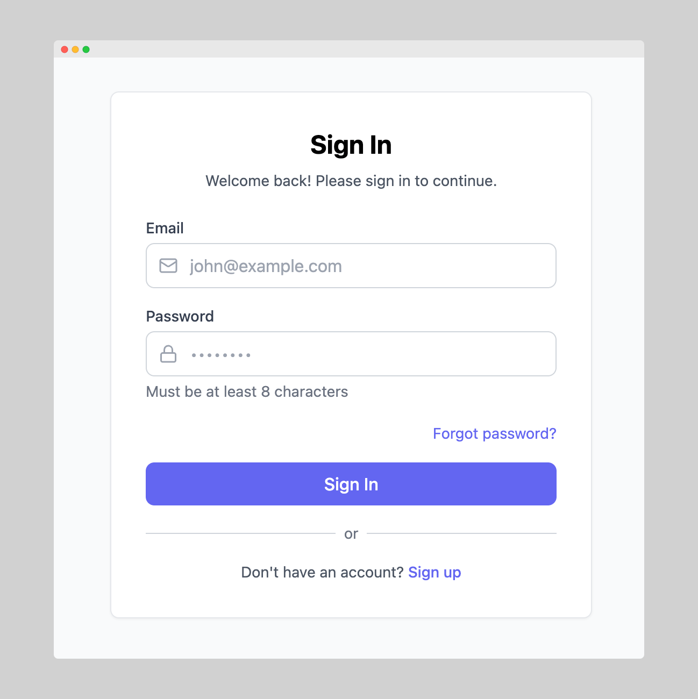

# Quantum Dashboard - Free React & Tailwind CSS Admin Template

[](https://choosealicense.com/licenses/mit/)
[](https://reactjs.org/)
[](https://tailwindcss.com/)

A modern, elegant, and **completely free** admin dashboard template built with React 19, TypeScript, and Tailwind CSS. Quantum Dashboard is designed to be fast, beautiful, and incredibly easy to customize, providing you with the perfect foundation to accelerate your SaaS application, admin panel, or management system development.

Whether you're building a startup MVP, internal tools, or a client project, Quantum Dashboard gives you a professional head start with production-ready components and a clean, developer-friendly codebase.

---

## 🎯 Live Demo

Experience Quantum Dashboard in action:

**[🚀 VIEW LIVE DEMO](https://quantum-dashboard-lhe8wzfgi-andris-projects-159d5020.vercel.app)**

---

## 📸 Preview

### Dashboard Home


<details>
<summary>📱 View More Screenshots</summary>

### Dashboard Home - Mobile


### Users Management


### Users Management - Mobile


### User Profile


### User Profile - Mobile


### Settings


### Settings - Mobile


### Mobile Navigation


### Login Page


</details>

---

## ✨ Key Features

- ⚛️ **Built with React 19 & TypeScript** - Strong typing and the latest React features for robust applications
- 🎨 **Styled with Tailwind CSS** - Utility-first approach that makes customization a breeze
- ⚡️ **Vite Tooling** - Lightning-fast builds and hot module replacement for the best DX
- 📱 **Fully Responsive** - Flawless design across desktop, tablet, and mobile devices
- 🧩 **10+ UI Components** - Professional, reusable components (Metric Cards, Tables, Charts, Forms, etc.)
- 📄 **5 Pre-built Pages** - Essential pages to kickstart any project (Dashboard, Users, Profile, Settings, Login)
- 💡 **Minimal & Clean Design** - Focus on usability and a delightful user experience
- 🚀 **Developer-Friendly** - Clean code, well-structured, and easy to understand
- 🎯 **Mobile-First Approach** - Optimized for mobile with hamburger menu navigation
- 🔒 **TypeScript Strict Mode** - Maximum type safety for production-ready code

---

## 🛠️ Tech Stack

Built with modern, battle-tested technologies:

- **[React 19](https://reactjs.org/)** - The latest version of the most popular UI library
- **[TypeScript](https://www.typescriptlang.org/)** - Type-safe JavaScript for better code quality
- **[Vite](https://vitejs.dev/)** - Next-generation frontend tooling
- **[Tailwind CSS 3](https://tailwindcss.com/)** - Utility-first CSS framework
- **[React Router v6](https://reactrouter.com/)** - Declarative routing for React
- **[Recharts](https://recharts.org/)** - Composable charting library
- **[Lucide React](https://lucide.dev/)** - Beautiful & consistent icon set

---

## 🚀 Getting Started

Get up and running in less than 2 minutes:

### 1. Clone the repository

```bash
git clone https://github.com/buskari/quantum-dashboard.git
```

### 2. Install dependencies

```bash
cd quantum-dashboard
npm install
```

### 3. Start the development server

```bash
npm run dev
```

Your application will be running at **http://localhost:5173** 🎉

### 4. Build for production

```bash
npm run build
```

---

## 📦 What's Included

### Pages
- 🏠 **Dashboard** - Overview with metrics, charts, and recent activity
- 👥 **Users** - User management with searchable table
- 👤 **Profile** - User profile with editable information
- ⚙️ **Settings** - Account settings, notifications, and security
- 🔐 **Login** - Clean authentication page

### Components
- 📊 **MetricCard** - Display key metrics with trend indicators
- 📈 **LineChart** - Visualize data with responsive charts
- 📋 **Table** - Sortable, searchable data tables
- 🎨 **Card** - Flexible container component
- 🔘 **Button** - Multiple variants and sizes
- 📝 **Input** - Form inputs with validation states
- 🏷️ **Badge** - Status indicators and labels
- 👤 **Avatar** - User profile images with fallbacks
- 🧭 **Navigation** - Responsive sidebar with mobile menu

---

## 📁 Project Structure

```
quantum-dashboard/
├── src/
│   ├── components/
│   │   ├── ui/           # Reusable UI components
│   │   ├── layout/       # Layout components (Sidebar, Header)
│   │   └── charts/       # Chart components
│   ├── pages/            # Page components
│   ├── App.tsx           # Main app component
│   └── main.tsx          # Entry point
├── public/               # Static assets
└── package.json          # Dependencies
```

---

## 🎨 Customization

Quantum Dashboard is built with customization in mind. The color palette, typography, and spacing can be easily modified in the `tailwind.config.js` file:

```js
colors: {
  primary: {
    50: '#eef2ff',
    500: '#6366f1',  // Change this to your brand color
    600: '#4f46e5',
  },
  // Add more custom colors
}
```

---

## 🌟 Looking for More? Check out the PRO Version!

While this free version is perfect for getting started, we're working on an **enhanced PRO version** packed with even more features:

- 🎯 **50+ Pages & Components** - Everything you need for complex applications
- 🔐 **Complete Authentication System** - JWT, social login (Google, GitHub), password recovery
- 🌓 **Dark Mode** - Beautiful light and dark themes
- 🔌 **Backend Integrations** - Ready-to-use API integration examples
- 📊 **Advanced Analytics** - Comprehensive dashboard with real-time data
- 🎨 **Multiple Color Schemes** - Pre-built theme variations
- 🛡️ **Advanced Security** - RBAC, 2FA, and more
- 📚 **Premium Support** - Priority support and regular updates

### 🎁 Early Bird Offer

Be among the first to know when the PRO version launches and get an exclusive discount!

**[✨ Join the Waitlist - Download FREE Version & Get Early Access](https://gumroad.com/l/quantum-dashboard)**

---

## 🤝 Contributing

Contributions are always welcome! If you'd like to improve Quantum Dashboard:

1. Fork the repository
2. Create your feature branch (`git checkout -b feature/AmazingFeature`)
3. Commit your changes (`git commit -m 'Add some AmazingFeature'`)
4. Push to the branch (`git push origin feature/AmazingFeature`)
5. Open a Pull Request

---

## 📝 License

This project is licensed under the **MIT License** - see the [LICENSE](LICENSE) file for details.

You are free to use this template for personal and commercial projects. Attribution is appreciated but not required.

---

## 💬 Support

Have questions or found a bug? Here's how to reach us:

- 🐛 **Bug Reports:** [Open an issue on GitHub](https://github.com/buskari/quantum-dashboard/issues)
- 💡 **Feature Requests:** [Open an issue on GitHub](https://github.com/buskari/quantum-dashboard/issues)
- 📧 **Email:** andrisbuscariolli88@gmail.com (for private inquiries)

We typically respond within 24-48 hours.

---

## ⭐ Show Your Support

If you find this project useful, please consider giving it a star on GitHub! It helps us reach more developers and keeps us motivated to maintain and improve the template.

**[⭐ Star on GitHub](https://github.com/buskari/quantum-dashboard)**

---

<div align="center">
  <p>Made with ❤️ by developers, for developers</p>
  <p>
    <a href="https://quantum-dashboard-lhe8wzfgi-andris-projects-159d5020.vercel.app">Live Demo</a> •
    <a href="https://github.com/buskari/quantum-dashboarbd">GitHub</a> •
    <a href="https://gumroad.com/l/quantum-dashboard">Download & PRO Waitlist</a>
  </p>
</div>